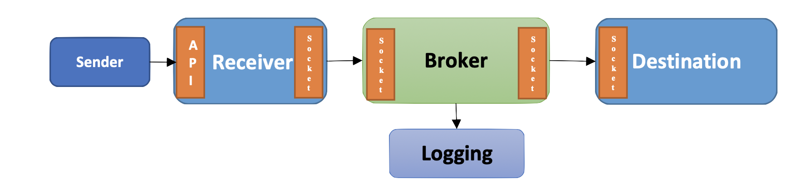

# 🪴 Simple Broker

_Experimental project for GraphInc. job interview._

Simple Broker is a golang based super simple message broking system which contains four different subpackages.

- 🚀 **Broker Service**: this service serves a gRPC server and will receive messages, log them, and forward them to the destination service in the background
- 🏗️ **Receiver Service**: this service serves as a HTTP Gateway for the _Broker Service_. It receives requests over HTTP and translates them into gRPC calls and translates the return values back to the HTTP response.
- 🗿 **Sender Service**: this service will try to generate random strings of size <10KB and send them over HTTP request to the _receiver service_.
- 🏰 **Destiantion Service**: is a sample destiantion service which serves a gRPC server and will calculate total proccessed message size as a sample procedure.

Using ✨Simple Broker✨ you can ask golang compile to build each service within a single project. Also, you can build them all together in a single binary file.

---

## Building and Usage

For detailed guide through building commands use these links:

- [Documents Folder](https://github.com/SamMHD/simple-broker/tree/main/docs)
- [Build Guide](https://github.com/SamMHD/simple-broker/blob/main/docs/build.md)
- [Usage Guide](https://github.com/SamMHD/simple-broker/blob/main/docs/usage.md)
- [Postman Workspace](https://github.com/SamMHD/simple-broker/blob/main/docs/postman_workspace.md)
- [Godoc](https://github.com/SamMHD/simple-broker/blob/main/docs/godoc.md)
