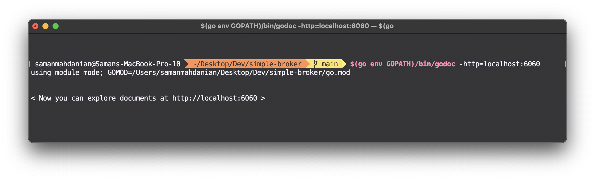

This project supports **Doc Comments**, therefore, you can use godoc tools inorder to navigate docs.

## GoDoc.org

you can explore documentation on: https://pkg.go.dev/github.com/SamMHD/simple-broker

## Local Build

Open your terminal and type:

```
$(go env GOPATH)/bin/godoc -http=localhost:6060
```

Now you can explore documentations at:
http://localhost:6060/pkg/github.com/SamMHD/simple-broker/
